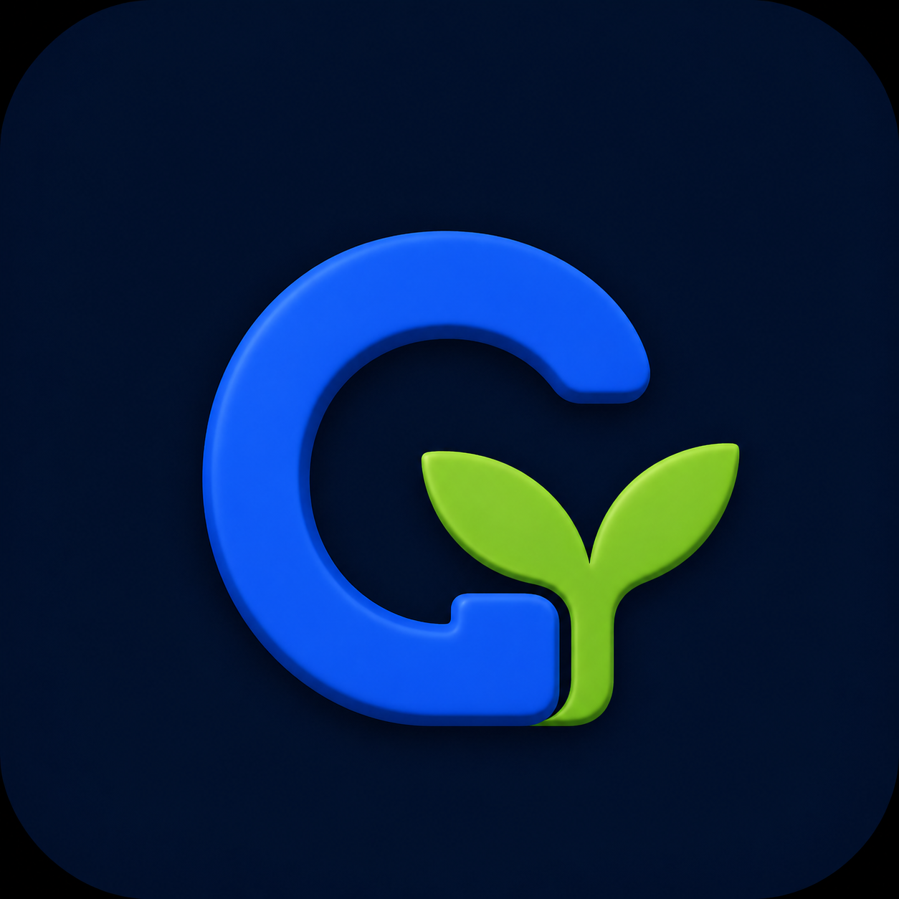

<!doctype html>
<html lang="ko">
  <head>
    <meta charset="utf-8">
    <meta name="viewport" content="width=device-width, initial-scale=1">
    <title>개인정보처리방침 | GYSoft</title>
    <meta name="description" content="GYSoft 앱별 개인정보처리방침 안내입니다.">
    <link rel="stylesheet" href="styles.css">
  </head>
  <body>
    <header class="site-header">
      <nav class="nav" aria-label="주요 메뉴">
        <a class="brand" href="index.html">
          
          GYSoft
        </a>
        

          <a href="index.html">회사소개</a>
          <a href="dualfullcount.html">듀얼:풀카운트</a>
          <a href="brickbuilder.html">브릭빌더</a>
          <a href="support.html">지원</a>
        

      </nav>
    </header>

    <main class="section compact policy">
      
Privacy

      <h1>개인정보처리방침</h1>
      

        GYSoft는 앱별 기능과 데이터 처리 방식이 다르기 때문에 개인정보처리방침을 앱별로 구분해 제공합니다.
        Google Play Console에는 등록하려는 앱에 맞는 전용 URL을 연결하는 것을 권장합니다.
      

      

        

          
          <h2>듀얼:풀카운트(Dual:FullCount)</h2>
        

        

          무료 모바일 턴제 덱빌딩 전략 야구게임입니다. 현재 광고 SDK를 포함하지 않는 게임으로, 브릭빌더와 별도의 개인정보처리방침을 사용합니다.
        

        

          <a class="button primary" href="privacy-dualfullcount.html">듀얼:풀카운트 정책 보기</a>
        

      

      

        

          
          <h2>브릭빌더(BrickBuilder)</h2>
        

        

          LDraw 호환 모델 파일을 열고 3D로 확인하는 모바일 뷰어입니다. 파일 처리, 브릭 라이브러리, 광고 SDK 관련 내용을 별도로 안내합니다.
        

        

          <a class="button primary" href="privacy-brickbuilder.html">브릭빌더 정책 보기</a>
        

      

    </main>

    <footer class="site-footer">
      

        
© 2026 GYSoft Cloud. All rights reserved.

      

    </footer>
  </body>
</html>
